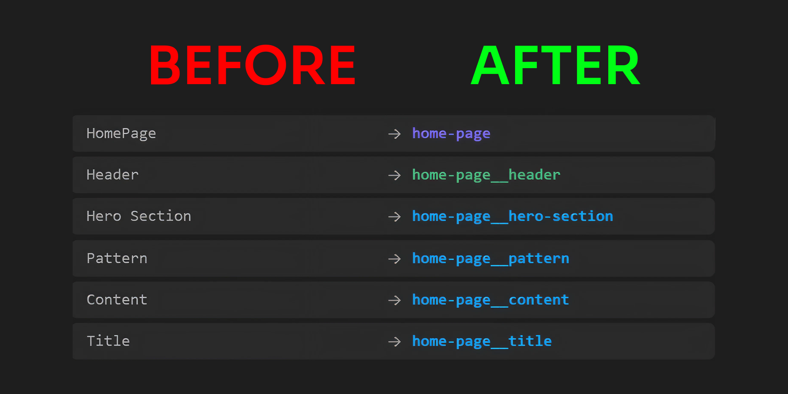

  

<h1 align="center">BEM Renamer</h1>

  Automatically rename your Figma layers following the <strong>BEM naming convention</strong>. 
  Built for designers who hand off to developers and AI code generators.

  

---

## Preview

---

## How it works

Name your layers with **meaningful names** first (`hero-section`, `card`, `nav-bar`), select them, and BEM Renamer handles the rest. The plugin reads your layer hierarchy and generates the full BEM structure automatically.

No need to know the convention. Just name your layers like you normally would, and the plugin does the work.

1. Select one or more frames or components
2. Type a block name (or let the plugin detect it)
3. Preview the result before applying
4. Hit Rename

---

## Features

- **Auto-detects modifiers** in layer names (active, disabled, hover, error...)
- **Flat or nested** element naming modes
- **Preview before applying**, nothing changes until you confirm
- **Undo history** for the last 10 operations
- **Custom modifier keywords**
- **Bilingual interface** (FR / EN)

---

## Why BEM?

BEM layer names are directly readable by **AI code generators** (Figma to Code, Anima, Builder.io...) and produce **clean, semantic CSS class names** instead of `.frame-47` or `.group-12`.

Your developers will thank you. Your AI tools will too.

---

## Install

[Get it on Figma Community](https://www.figma.com/community/plugin/1636368260602922314)

---

## License

This repository contains no source code. All rights reserved.
